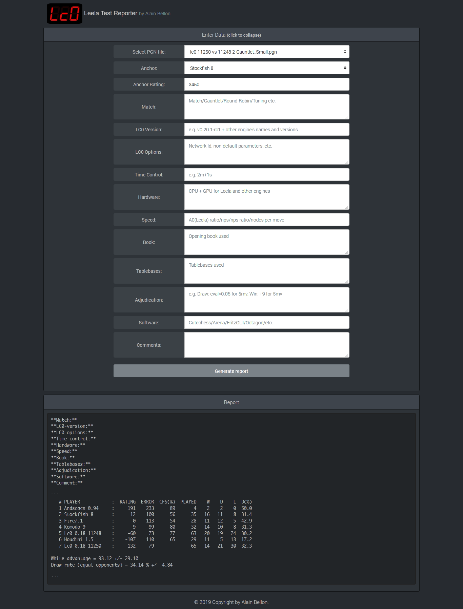

# Leela Test Reporter
Tool for generating discord-postable test results from pgn files. It will let you select an anchor engine and rating, and will remember your previously entered data so you don't have to retype it every time.



## Installation and Running

### Windows

#### Command Line

1. Install Python 3
2. Copy your .pgn files to the /PGN folder
3. Open a cmd window in the LTR.py folder and type:
```
python LTR.py
```

#### Executable Release

1. Copy your .pgn files to the /PGN folder
2. Double click on LTR.exe

### Linux

1. Install python if you don't have it already:
```
sudo apt-get install python3
```
2. Copy your .pgn files to the /PGN folder
3. In the LTR.py folder run the python script:
```
LTR.py
```

## Usage

1. Wait for the web GUI to open in  your browser
2. Enter your data
3. Press the Generate Report button
4. Copy the report to discord
5. Close your browser tab (in some cases you may need to close the command window as well)
